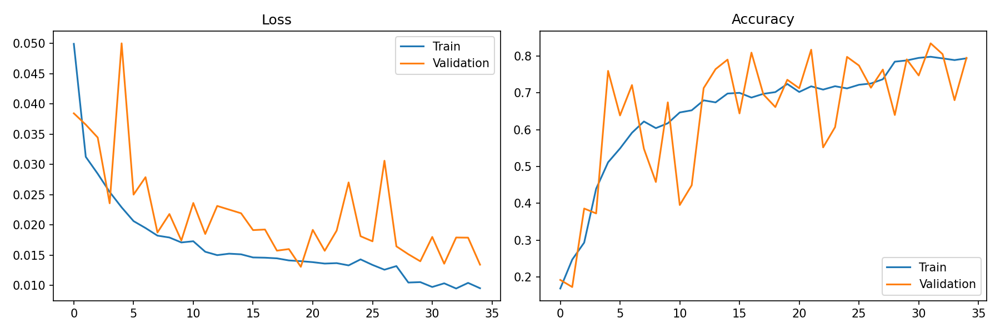
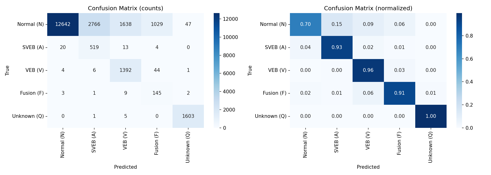
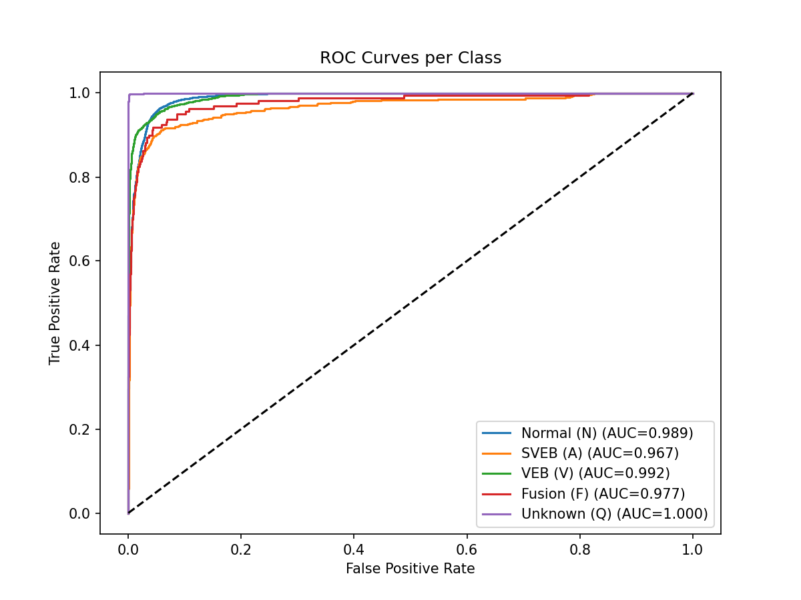

# ECG Arrhythmia Classification using CNN-LSTM

A deep learning model for automated cardiac arrhythmia detection from ECG signals, achieving **Mean AUC of 0.985** across 5 arrhythmia classes on the MIT-BIH Arrhythmia Database.

## Results

| Class | Recall | AUC |
|-------|--------|-----|
| Normal (N) | 0.70 | 0.989 |
| SVEB - Supraventricular Ectopic (A) | 0.93 | 0.967 |
| VEB - Ventricular Ectopic (V) | 0.96 | 0.992 |
| Fusion (F) | 0.91 | 0.977 |
| Unknown/Paced (Q) | 1.00 | 1.000 |
| **Mean** | **0.90** | **0.985** |

> Macro F1: 0.58 — reflects precision/recall tradeoff on severely imbalanced classes (82.8% Normal vs 0.7% Fusion). AUC of 0.985 demonstrates strong discriminative ability across all classes.

## Architecture
ECG Signal (187 samples)

↓

CNN Block 1: Conv1D(1→32) + BN + ReLU + MaxPool

↓

CNN Block 2: Conv1D(32→64) + BN + ReLU + MaxPool

↓

CNN Block 3: Conv1D(64→128) + BN + ReLU + MaxPool

↓

Bidirectional LSTM (128 hidden, 2 layers) + Attention

↓

Classifier: Linear(256→128→5)

↓

5-class Arrhythmia Prediction

**Why CNN + LSTM:**
- 1D CNN extracts local morphological features from PQRST waveforms
- Bidirectional LSTM captures temporal dependencies across the beat sequence
- Attention pooling weights the most diagnostically relevant timesteps

## Dataset

- **Source:** MIT-BIH Arrhythmia Database (PhysioNet)
- **Size:** 109,466 beat segments extracted from 48 half-hour ECG recordings
- **Segment length:** 187 samples (90 pre R-peak + R-peak + 96 post)
- **Classes:** AAMI standard 5-class grouping
- **Class imbalance:** 82.8% Normal — handled with Focal Loss (γ=0.5) + inverse frequency class weighting

## Training Details

| Parameter | Value |
|-----------|-------|
| Optimizer | Adam (lr=1e-3, weight_decay=1e-4) |
| Loss | Focal Loss (γ=0.5) with class weights |
| Batch size | 64 |
| Early stopping | patience=15 epochs |
| Gradient clipping | max_norm=1.0 |
| LR scheduler | ReduceLROnPlateau (patience=7, factor=0.5) |
| Train/Val/Test split | 70/10/20 stratified |

## Visualizations

### Training Curves


### Confusion Matrix


### ROC Curves


## Project Structure
ecg-arrhythmia-classification/
├── src/
│   ├── datasets.py      # MIT-BIH data loading, segmentation, normalization
│   ├── model.py         # CNN-LSTM architecture with attention
│   ├── train.py         # Focal loss, training loop, early stopping
│   └── evaluate.py      # Confusion matrix, ROC curves, per-class metrics
├── main.py              # End-to-end training and evaluation pipeline
├── requirements.txt
└── README.md

## Setup & Usage

```bash
# Install dependencies
pip install -r requirements.txt

# Train and evaluate (downloads MIT-BIH automatically if mitdb/ not present)
python main.py
```

## Tech Stack


- **PyTorch** — model architecture and training
- **wfdb** — PhysioNet MIT-BIH data loading
- **scikit-learn** — evaluation metrics, train/test split
- **NumPy / Matplotlib / Seaborn** — data processing and visualization
